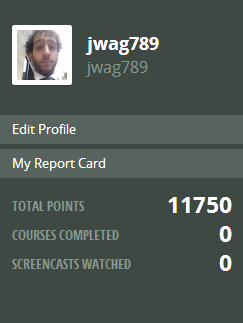

#### Include an inline screenshot of your codeschool's points from the profile page:

##QUIZ
* Explain which tabs support the following actions and how.
  * Realtime editing of HTML and CSS 

    The "Elements" tab, which consists of a section with HTML, and a connected "Styles" tab that has the CSS. You can double click on any of the attributes, add attributes, and change around the HTML and CSS with these tabs.

  * Javascript Debugging

    This is in the "Sources" tab. You can see a list of JavaScript files, open a file to play with, and have the ability to pause, resume, and step through the code.

  * Performance Optimization

    This happens in the "Networks". It will give you a list of files, their types, size, and timeline which shows when the request for the file was made, and when the request was finished.

* What's the quick key for your OS to spawn the Dev Tools inspector?

    On Windows, it's Ctrl + Shift + I

* Go to http://www.postmachina.com/ and analyze and tweak this nicely designed page.
  * What is the current background color for the page?  (Surprisingly, it's not just black!)

  The background color is #0b0f11.

  * Tweak the background color to white.
  * Tweak the height of the side bar that contains the logo.  Shrink it down to 85px.
  * Roll over the navigation links.  When you hover over them, they dissapear.  Let's change the hover color to black instead.
  * Now take a screenshot of your new (and maybe not so improved) design.  It should match this screenshot: http://postimg.org/image/5ak1jkpl5/
  * Upload your own image to the imgs directory in the `1_Chrome_Dev_Tools` directory.  It should match the image above. The last nav link in the image above is black because the mouse was hovering there when the screenshot was taken. Do the same, and don't take a screenshot of your whole desktop, just the browser window. (This is part of the challenge.)

* For the postmachina website, why can't you tweak the color of the text "The most important things are not things"?  Please explain.

    At first I was confused by this. I tried changing the color, and then editing the text itself. I realized there had to be some sort of trick. I then decided to inspect the element, and I looked into the CSS. There, I realized that the text was actually part of an image (http://www.postmachina.com/images/home_bg.gif) that was being used as a background image.

* Go to www.ticketswizard.com and analyze the page.  
  * What is the largest image on the website?

  * Explain how you would find out this information, and list the URL of offending image here and how big it is.

  The largest image on the page is this: 

    http://www.ticketswizard.com/Images/Catalog/92624182-c482-4a35-8da2-4fbf2f502e94_Large_Large.png

  I found this out by going to the Networks tab, and sorting the files by descending size. I then looked at the image with the greatest file size, which is the image I linked. It is 316 KB, with the next largest image being 291 KB.

* Test the www.ticketswizard.com website with google's [PageSpeed Insights](http://www.ticketswizard.com/).  (You can also download the chrome plugin).  What is the easiest thing to change to optimize the website?  How many kilobytes of data can be eliminated?

    The easiest thing to change to optimize the website would be to reduce all of the image sizes. By losslessly compressing all of the images, you could reduce the size of date on the webpage by 39%, or 885.9 KiB (about 907 KB).